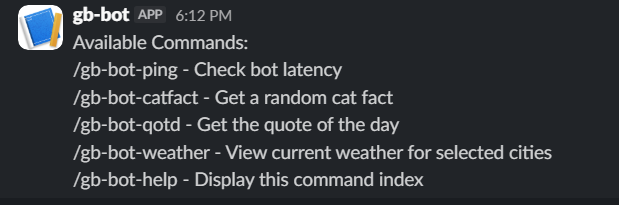
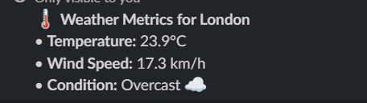

Hello World!!
   This is my personal slack bot project call "THE GB-BOT". It is a fun basic bot which can tell you the weather in 5 cities, a cute fact about cats and the quote of the day. It also has a /gb-bot-help command to show you the available commands.

Available commands:

    - /gb-bot-ping : Check bot latency
    - /gb-bot-catfact : Get a random cute cat fact
    - /gb-bot-qotd : Get the quote of the day
    - /gb-bot-weather : View current weather for selected cities
    - /gb-bot-help : Display the command list

